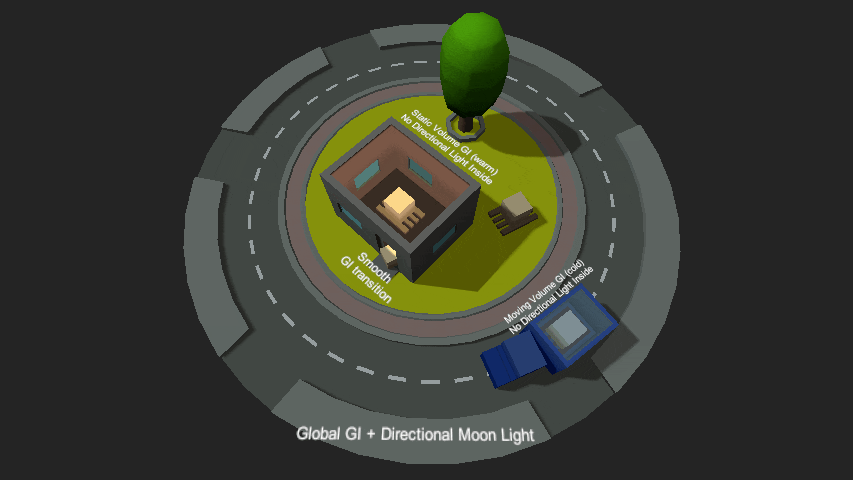
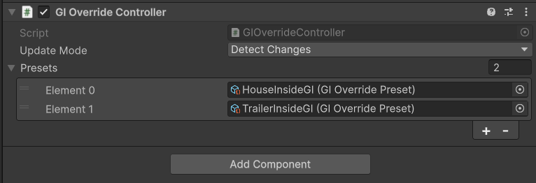
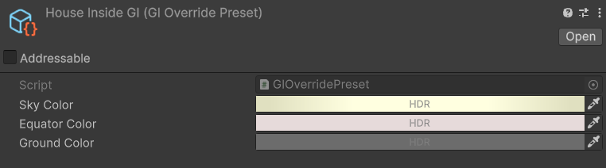
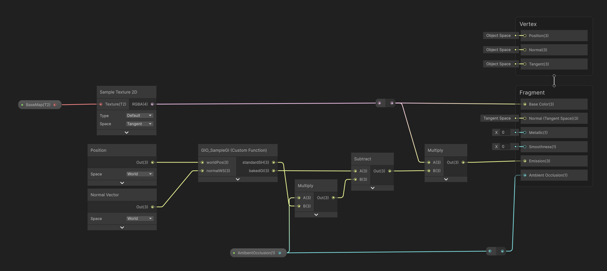

# GI Override Volumes



Box-volume-based global illumination overrides for Unity URP. Replaces the standard ambient SH inside a region using oriented signed distance field blending, compatible with handwritten shaders and Shader Graph.

## How it works

1. A **`GIOverrideController`** on the scene holds an array of **`GIOverridePreset`** assets. Each preset defines trilight ambient colors (sky / equator / ground) that are baked into L2 spherical harmonics at runtime.
2. **`GIOverrideVolume`** components define oriented box regions in world space. Each volume selects one preset by index. The box respects the GameObject's full transform — position, rotation, and scale.
3. The controller compares world-space volume state and preset colors against a snapshot each frame and uploads packed SH + geometry data to global shader arrays only when something has changed.
4. Shaders include **`GIOverride.hlsl`** and call `GIO_SampleGI(worldPos, normalWS)`, which evaluates an oriented SDF for every active volume, blends the per-volume SH contributions proportionally by weight, and falls back to the standard URP ambient SH outside all volumes.

## Setup

### 1 — Controller

Add `GIOverrideController` to a scene-level GameObject (e.g. *GraphicsManager*).



Create `GIOverridePreset` assets via **Assets → Create → GI Override → Preset** and populate the **Presets** array on the controller.



### 2 — Volumes

Add `GIOverrideVolume` to any GameObject. Set **Preset Index** to the index of the desired preset in the controller's array. Resize and reposition using the scene handle — it works like a Box Collider and respects the transform's rotation and scale.

Set **Blend Smoothness** to control the volume's blending.


### 3 — Shaders

**Shader Graph (Custom Function node):**
 - prepacked subgraph is included in the package. It's located in the `Packages/com.gulievstudio.globalilluminationoverride/Shaders/Subgraphs/SGSUB_GIOverride.shadergraph`
- demo of how to use it located in the `/Samples/Shaders/SG_GIOverriden` shader graph.



Shader Graph override for the Lit target shader isolates difference between standard GI and overridden GI and then adds it to the emission slot.

This is a workaround. For the best results you should override original SampleGI by creating Lit shader from scratch.

**Handwritten URP shader:**
```hlsl
#include "Packages/com.gulievstudio.globalilluminationoverride/Shaders/Include/GIOverride.hlsl"

// In the fragment stage replace `gi = SampleGI(positionWS, normalWS);` with:
half3 gi = GIO_SampleGI(positionWS, normalWS);
```

## Update modes

Set via the **Update Mode** field on `GIOverrideController`.

| Mode | Behaviour |
|---|---|
| `WhenDirty` *(default)* | Compares world-space volume state and preset colors every frame; uploads only when a change is detected. Zero GPU uploads on fully static scenes. |
| `EveryFrame` | Uploads unconditionally every `LateUpdate`. Use when volumes are driven by animation or script each frame. |
| `OnDemand` | Never uploads automatically. Call `GIOverrideController.Instance.UpdateNow()` from your own code. |

When a `GIOverridePreset`'s colors are changed at runtime via code, call `GIOverrideController.MarkDirty()` to trigger an upload on the next frame.

## Limits

| Constant | Default | Description |
|---|---|---|
| `GIO_MAX_VOLUMES` | `8` | Maximum simultaneously active volumes |

By default the limit is hardcoded  to 8. You can override it by changing constant in GIOverrideController.cs and GIOverride.hlsl

Keeping constant value low (e.g. 4) is recommended for mobile targets to reduce per-fragment loop cost.

## Notes

- Volumes use an oriented box SDF - rotation is fully respected. The blend boundary in the scene view matches what the shader computes.
- Multiple overlapping volumes are blended proportionally by SDF weight; the result is normalized before being mixed with the standard SH.
- Volumes beyond the `GIO_MAX_VOLUMES` active slot limit are silently skipped, ordered by registration time (scene load order).
- The controller reads world-space transform data from the volume hierarchy, so parent-transform animations and scale inheritance are detected automatically in `WhenDirty` mode.
